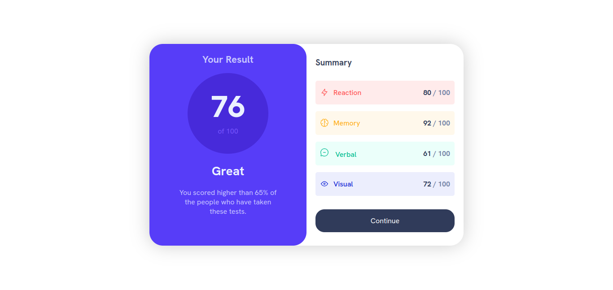

## Table of contents

- [My process](#my-process)
  - [Built with](#built-with)
  - [Continued development](#continued-development)

### Screenshot

## My process

I started designing my html which cost me a bit because I didn't understand very well how to position the right part of the page, the left part was quite easy. After that I started with the CSS which was complicated more than anything because of the colors I had to use on the website.

### Built with

- Semantic HTML5 markup
- CSS custom properties
- Flexbox
- CSS Grid

### Continued development

I will continue development my knowledge in responsive design and my layout in HTML.

